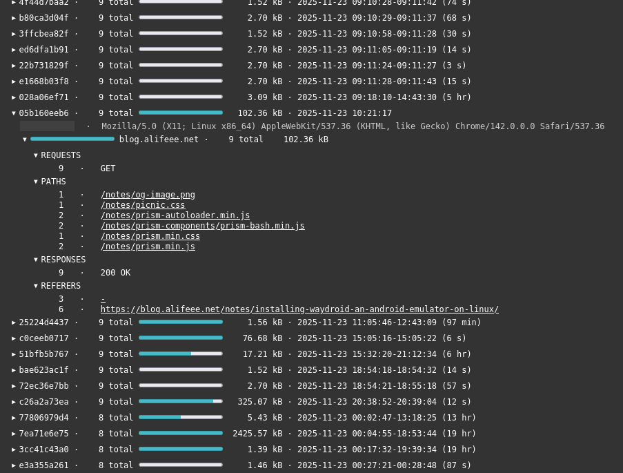

> [!CAUTION]
> MOVED! see <https://git.alifeee.net/nginx-access-log-parser/about/>
# Nginx log parser

Parses Nginx logs, particularly useful if multiple domains are served from one Nginx instance.



Currently, can consume one `access.log` and creates:

- `access.csv`
- `access.json`
- `access.html` (most useful)

Usage:

```bash
python3 parse.py /var/log/access.log
```

to-do:

- provide CSS/JS in HTML file instead of external dependencies
- make file automatically on log rotation like <https://github.com/alifeee/nginx-user-dashboard>
